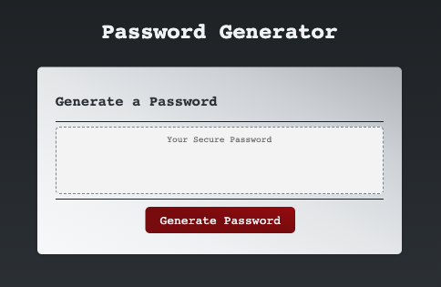

# Random Password Generator

## Table of contents

- [Overview](#overview)
- [Acceptance Criteria](#acceptance-criteria)
- [Portfolio Demo](#portfolio-demo)
- [Links](#links)
- [My process](#my-process)
- [Built with](#built-with)
- [What I learned](#what-i-learned)
- [Useful resources](#useful-resources)
- [Author](#author)
- [Acknowledgments](#acknowledgments)

## Overview

- This application was built to consolidate JavaScript skills I have learned so far - it enables an employee to generate a random password based on criteria they’ve selected.

- This app runs in the browser, and features dynamically updated HTML and CSS powered by JavaScript code.

- It will have a clean and polished user interface that is responsive, ensuring that it adapts to multiple screen sizes.

- HTML and CSS have been included in a starter code but re-styled according to the client's preferences

## Acceptance Criteria

- Generate a password when the button is clicked

  - Present a series of prompts for password criteria

    - Length of password
      - At least 10 characters but no more than 64.
    - Character types
      - Lowercase
      - Uppercase
      - Numeric
      - Special characters ($@%&\*, etc)

  - Code should validate for each input and at least one character type should be selected

  - Once prompts are answered then the password should be generated and displayed in an alert or written to the page

#### Additional Technical Acceptance and Quality Criteria

- The app should not produce any errors in the console when inspected using Chrome DevTools.

- Application user experience is intuitive and easy to navigate.

- Application user interface style is clean and polished.

- Application resembles the mock-up functionality provided in the challenge instructions.

## Application Screenshot

The following animation shows my web aplication's appearance:

## Links

You will be able to acces the app URL if you navigate into Settings → Pages inside this repository.

Or, click on this link: [Password Generator](link)

## Built with...

- HTML
- CSS
- JavaScript

## What I learned

- Focus was on JavaScript functions recap

- I've learned that console and DevTools are my best friends when working with JS

- Key takeaways from this project, along challenges encountered:

  - If executed function is resulting in 'undefined' always check if it was returned! Challenge: I had an issue with calling a nested function within the main function - for some reason object arrays from password options functions was not returnng any values when ran in the main function.

## Useful Resources

- [JavaScript Functions](https://developer.mozilla.org/en-US/docs/Web/JavaScript/Guide/Functions)

- [JavaScript Loops & Iteration](https://developer.mozilla.org/en-US/docs/Web/JavaScript/Guide/Loops_and_iteration)

- [JavaScript Math.random()](https://developer.mozilla.org/en-US/docs/Web/JavaScript/Reference/Global_Objects/Math/random)

- [Document.querySelector() - Web APIs](https://developer.mozilla.org/en-US/docs/Web/API/Document/querySelector)

- [Document.getElementById() - Web APIs](https://developer.mozilla.org/en-US/docs/Web/API/Document/getElementById)

## Author

©️ Helena Gilja

- GitHub - [cyberrie](https://github.com/cyberrie)

## Acknowledgments

🌟 Big thanks to my fellow Developer Warren and my tutor Alistair for answering some of the questions I had when completing this project.
